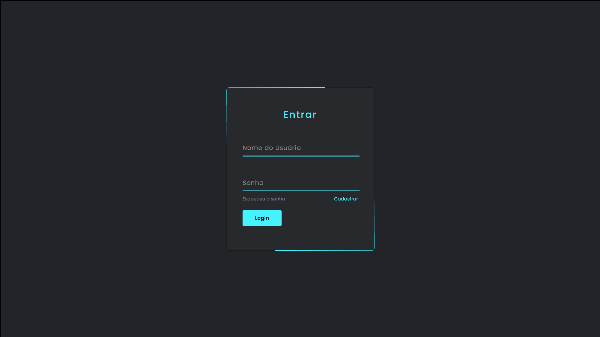

<h1 align="center">Login</h1>

Formulário de Login
 
<h3 align="center"><a href="" target="_blank"><strong>[ VEJA AGORA ]</strong></a></h3>

---

 

  

## 💻 Projeto

Formulário de login com animações.

## 🚀 Tecnologias

As seguintes ferramentas foram usadas na construção do projeto:

- [HTML]
- [CSS]

Made with 💟 by Damien Costa ✌🏿

<a href="https://www.linkedin.com/in/damien-costa/" target="_blank">
